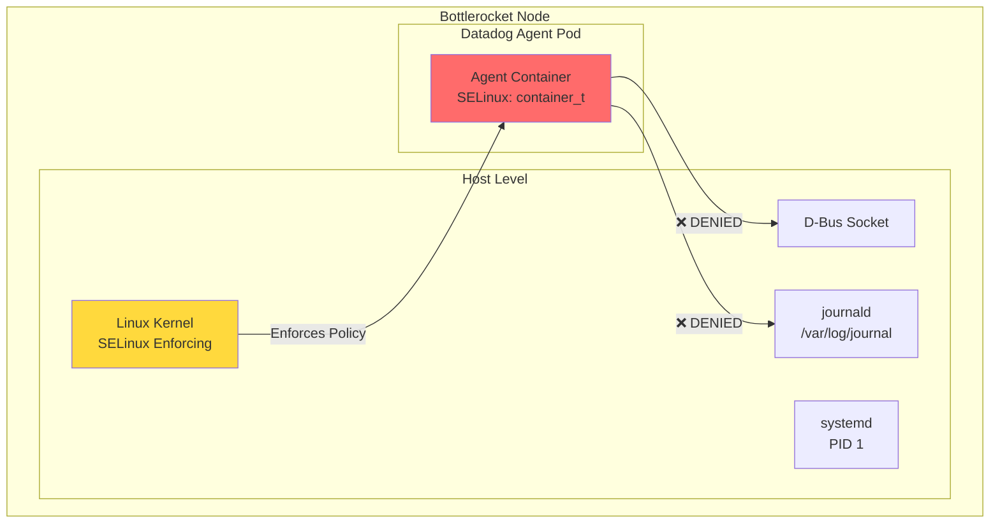

# Bottlerocket SELinux - systemd/journald Access Denied

## Context

On EKS with Bottlerocket nodes, the Datadog Agent's `systemd` check fails with:
```
Error running check: error getting list of units: SELinux policy denies access: Permission denied
```

Bottlerocket enforces SELinux by default. Without explicit `seLinuxOptions` in the pod spec, the agent container cannot access host systemd D-Bus socket or journald files.

## Environment

| Component | Version |
|-----------|---------|
| **Agent Version** | 7.60.1 |
| **Helm Chart** | datadog/datadog 3.85.0 |
| **Platform** | EKS with Bottlerocket |
| **Bottlerocket Version** | 1.52.0 |
| **Kubernetes Version** | 1.31+ |
| **Affected Integrations** | systemd, journald |

## Schema



## Quick Start

### Prerequisites

```bash
# Verify AWS access
aws-vault exec sso-tse-sandbox-account-admin -- aws sts get-caller-identity
```

### 1. Create EKS Cluster with Bottlerocket

```bash
aws-vault exec sso-tse-sandbox-account-admin -- eksctl create cluster \
  --name dd-bottlerocket-repro \
  --region us-east-1 \
  --nodegroup-name bottlerocket-ng \
  --node-ami-family Bottlerocket \
  --node-type t3.medium \
  --nodes 1 \
  --nodes-min 1 \
  --nodes-max 1 \
  --version 1.31
```

⏱️ **Note:** Cluster creation takes ~15-20 minutes.

**Check cluster creation progress:**

```bash
# Check cluster status
aws-vault exec sso-tse-sandbox-account-admin -- aws eks describe-cluster \
  --name dd-bottlerocket-repro \
  --region us-east-1 \
  --query 'cluster.status' \
  --output text

# Check CloudFormation stack progress
aws-vault exec sso-tse-sandbox-account-admin -- aws cloudformation describe-stacks \
  --stack-name eksctl-dd-bottlerocket-repro-cluster \
  --region us-east-1 \
  --query 'Stacks[0].StackStatus' \
  --output text

# Watch nodegroup creation
aws-vault exec sso-tse-sandbox-account-admin -- aws eks describe-nodegroup \
  --cluster-name dd-bottlerocket-repro \
  --nodegroup-name bottlerocket-ng \
  --region us-east-1 \
  --query 'nodegroup.status' \
  --output text
```

### 2. Configure kubectl

```bash
aws-vault exec sso-tse-sandbox-account-admin -- aws eks update-kubeconfig --name dd-bottlerocket-repro --region us-east-1
```

Set up kubectl alias for convenience:

```bash
alias k="aws-vault exec sso-tse-sandbox-account-admin -- kubectl"
```

### 3. Verify Bottlerocket Node

```bash
aws-vault exec sso-tse-sandbox-account-admin -- kubectl get nodes -o wide
aws-vault exec sso-tse-sandbox-account-admin -- kubectl describe node | grep -A5 "System Info"
```

Expected output should show:
- OS Image: `Bottlerocket OS 1.x.x`
- Container Runtime: `containerd://`

### 4. Deploy Datadog Agent WITHOUT SELinux Options (Reproduce Issue)

Create namespace and secret:

```bash
aws-vault exec sso-tse-sandbox-account-admin -- kubectl create namespace datadog
aws-vault exec sso-tse-sandbox-account-admin -- kubectl create secret generic datadog-secret -n datadog --from-literal=api-key=$DD_API_KEY
```

Create `values-no-selinux.yaml`:

```yaml
datadog:
  site: "datadoghq.com"
  apiKeyExistingSecret: "datadog-secret"
  clusterName: "bottlerocket-repro"
  kubelet:
    tlsVerify: false
  logs:
    enabled: true
    containerCollectAll: true
  processAgent:
    enabled: true
    processCollection: true
  systemProbe:
    enabled: true
    enableTCPQueueLength: false
    enableOOMKill: true
    collectDNSStats: false

# systemd check configuration
confd:
  systemd.yaml: |-
    init_config:
    instances:
      - unit_names:
          - kubelet.service
          - containerd.service
          - chronyd.service

# journald log collection
confd:
  journald.yaml: |-
    logs:
      - type: journald
        path: /var/log/journal/
        source: journald

agents:
  image:
    tag: 7.60.1
  
  # Mount journald
  volumes:
    - name: journald
      hostPath:
        path: /var/log/journal/
    - name: machineid
      hostPath:
        path: /etc/machine-id
  
  volumeMounts:
    - name: journald
      mountPath: /var/log/journal/
      readOnly: true
    - name: machineid
      mountPath: /etc/machine-id
      readOnly: true

  # NO seLinuxOptions - this will cause the issue
  # podSecurity:
  #   seLinuxContext:
  #     seLinuxOptions:
  #       user: "system_u"
  #       role: "system_r"
  #       type: "spc_t"
  #       level: "s0"

clusterAgent:
  enabled: true
```

Deploy:

```bash
aws-vault exec sso-tse-sandbox-account-admin -- helm repo add datadog https://helm.datadoghq.com
aws-vault exec sso-tse-sandbox-account-admin -- helm repo update
aws-vault exec sso-tse-sandbox-account-admin -- helm upgrade --install datadog-agent datadog/datadog -n datadog -f values-no-selinux.yaml
```

### 5. Wait for Agent Ready

```bash
aws-vault exec sso-tse-sandbox-account-admin -- kubectl wait --for=condition=ready pod -l app=datadog-agent -n datadog --timeout=300s
```

## Test Commands

### Verify SELinux Error

```bash
# Check agent status - systemd check should show ERROR
aws-vault exec sso-tse-sandbox-account-admin -- kubectl exec -n datadog daemonset/datadog-agent -c agent -- agent status | grep -A20 "systemd"

# Check agent logs for SELinux errors
aws-vault exec sso-tse-sandbox-account-admin -- kubectl logs -n datadog -l app=datadog-agent -c agent | grep -i selinux

# Run systemd check manually
aws-vault exec sso-tse-sandbox-account-admin -- kubectl exec -n datadog daemonset/datadog-agent -c agent -- agent check systemd
```

### Verify Container SELinux Context

```bash
# Get the agent pod name
POD=$(aws-vault exec sso-tse-sandbox-account-admin -- kubectl get pods -n datadog -l app=datadog-agent -o jsonpath='{.items[0].metadata.name}')

# Check the SELinux context (should show container_t or similar restricted type)
aws-vault exec sso-tse-sandbox-account-admin -- kubectl exec -n datadog $POD -c agent -- cat /proc/self/attr/current
```

## Expected vs Actual

| Behavior | Expected (with fix) | Actual (without fix) |
|----------|---------------------|----------------------|
| systemd check | ✅ Collects unit metrics | ❌ `SELinux policy denies access: Permission denied` |
| journald logs | ✅ Logs collected | ❌ Cannot read journal files |
| SELinux context | `system_u:system_r:spc_t:s0` | `system_u:system_r:container_t:s0:c...` |

### Screenshots

**Agent Status - systemd check ERROR:**
```
systemd
-------
  Instance ID: systemd:7461a44c554ac620 [ERROR]
  Configuration Source: file:/etc/datadog-agent/conf.d/systemd.yaml
  Total Runs: 2,755
  Metric Samples: Last Run: 0, Total: 0
  Error: error getting list of units: SELinux policy denies access: Permission denied
```

## Fix / Workaround

### Apply SELinux Options

Create `values-with-selinux.yaml`:

```yaml
datadog:
  site: "datadoghq.com"
  apiKeyExistingSecret: "datadog-secret"
  clusterName: "bottlerocket-repro"
  kubelet:
    tlsVerify: false
  logs:
    enabled: true
    containerCollectAll: true
  processAgent:
    enabled: true
    processCollection: true
  systemProbe:
    enabled: true
    enableTCPQueueLength: false
    enableOOMKill: true
    collectDNSStats: false

# systemd check configuration  
confd:
  systemd.yaml: |-
    init_config:
    instances:
      - unit_names:
          - kubelet.service
          - containerd.service
          - chronyd.service

# journald log collection
confd:
  journald.yaml: |-
    logs:
      - type: journald
        path: /var/log/journal/
        source: journald

agents:
  image:
    tag: 7.60.1
  
  # Mount journald
  volumes:
    - name: journald
      hostPath:
        path: /var/log/journal/
    - name: machineid
      hostPath:
        path: /etc/machine-id
  
  volumeMounts:
    - name: journald
      mountPath: /var/log/journal/
      readOnly: true
    - name: machineid
      mountPath: /etc/machine-id
      readOnly: true

  # ✅ FIX: Add SELinux options for Bottlerocket
  podSecurity:
    seLinuxContext:
      seLinuxOptions:
        user: "system_u"
        role: "system_r"
        type: "spc_t"  # Super Privileged Container - allows host access
        level: "s0"

clusterAgent:
  enabled: true
```

Apply the fix:

```bash
aws-vault exec sso-tse-sandbox-account-admin -- helm upgrade --install datadog-agent datadog/datadog -n datadog -f values-with-selinux.yaml
```

### Verify Fix

```bash
# Wait for rollout
aws-vault exec sso-tse-sandbox-account-admin -- kubectl rollout status daemonset/datadog-agent -n datadog

# Check systemd check now works
aws-vault exec sso-tse-sandbox-account-admin -- kubectl exec -n datadog daemonset/datadog-agent -c agent -- agent check systemd

# Verify SELinux context changed
POD=$(aws-vault exec sso-tse-sandbox-account-admin -- kubectl get pods -n datadog -l app=datadog-agent -o jsonpath='{.items[0].metadata.name}')
aws-vault exec sso-tse-sandbox-account-admin -- kubectl exec -n datadog $POD -c agent -- cat /proc/self/attr/current
# Should show: system_u:system_r:spc_t:s0
```

## Alternative SELinux Types

| Type | Description | Use Case |
|------|-------------|----------|
| `spc_t` | Super Privileged Container | Standard fix, widely recognized |
| `super_t` | Bottlerocket-specific super type | Alternative for Bottlerocket |
| `container_t` | Default container type | ❌ Too restrictive for host access |

## Troubleshooting

```bash
# Pod logs
aws-vault exec sso-tse-sandbox-account-admin -- kubectl logs -n datadog -l app=datadog-agent -c agent --tail=100 | grep -i selinux

# Describe pod (check security context)
aws-vault exec sso-tse-sandbox-account-admin -- kubectl get pod -n datadog -l app=datadog-agent -o yaml | grep -A10 securityContext

# Get events
aws-vault exec sso-tse-sandbox-account-admin -- kubectl get events -n datadog --sort-by='.lastTimestamp'

# Check Bottlerocket SELinux status (via SSM if available)
# SELinux is always enforcing on Bottlerocket - cannot be disabled

# Verify mounts
aws-vault exec sso-tse-sandbox-account-admin -- kubectl exec -n datadog daemonset/datadog-agent -c agent -- ls -la /var/log/journal/
```

## Cleanup

```bash
# Delete Datadog agent
aws-vault exec sso-tse-sandbox-account-admin -- kubectl delete namespace datadog

# Delete EKS cluster
aws-vault exec sso-tse-sandbox-account-admin -- eksctl delete cluster --name dd-bottlerocket-repro --region us-east-1
```

## Key Takeaways

1. **Bottlerocket enforces SELinux by default** - unlike Amazon Linux 2 or Ubuntu
2. **The Helm chart supports SELinux options** but they're not enabled by default
3. **`spc_t` (Super Privileged Container)** is required for host systemd/journald access
4. **This is a configuration issue, not a bug** - the fix is adding the correct values

## References

- [Datadog Kubernetes Agent Installation](https://docs.datadoghq.com/containers/kubernetes/installation/)
- [Datadog systemd Integration](https://docs.datadoghq.com/integrations/systemd/)
- [Datadog journald Integration](https://docs.datadoghq.com/integrations/journald/)
- [Bottlerocket Security Features](https://bottlerocket.dev/en/os/latest/#/concepts/security/)
- [AWS EKS Bottlerocket](https://docs.aws.amazon.com/eks/latest/userguide/eks-optimized-ami-bottlerocket.html)
- [SELinux and Containers](https://www.redhat.com/en/topics/linux/what-is-selinux)
