# Bottlerocket SELinux + Datadog system-probe Sandbox

## 🎯 Issue Summary

**system-probe** running as `container_t` with MCS labels is **blocked by SELinux** from inspecting other containers on Bottlerocket nodes.

This sandbox reproduces the issue and demonstrates the workaround using `seLinuxOptions`.

---

## 📋 Environment

| Component | Version |
|-----------|---------|
| **Kubernetes** | 1.33 on EKS |
| **Bottlerocket OS** | 1.52.0 |
| **Datadog Helm Chart** | 3.85.0 |
| **Datadog Agent Image** | 7.60.1 |
| **Cluster Name** | `dd-bottlerocket-repro` |
| **Region** | `us-east-1` |

---

## 🔴 Reproduced SELinux Denials

### 1. `signull` Denial (Process Checking)
```
avc:  denied  { signull } for  pid=33121 comm="kill" 
  scontext=system_u:system_r:container_t:s0:c133,c439 
  tcontext=system_u:system_r:container_t:s0:c565,c975 
  tclass=process permissive=0
```
**Impact:** system-probe cannot check if processes in other containers exist (kill -0)

### 2. `search` Denial (Filesystem Access)
```
avc:  denied  { search } for  pid=29591 comm="system-probe" name="/" dev="overlay" 
  scontext=system_u:system_r:container_t:s0:c133,c439 
  tcontext=system_u:object_r:data_t:s0:c565,c975 
  tclass=dir permissive=0
```
**Impact:** system-probe cannot access other containers' overlay filesystems

### 3. `search` Denial (Secrets Access)
```
avc:  denied  { search } for  pid=29591 comm="system-probe" 
  scontext=system_u:system_r:container_t:s0:c133,c439 
  tcontext=system_u:object_r:secret_t:s0 
  tclass=dir permissive=0
```
**Impact:** system-probe cannot access Kubernetes secrets directories

---

## 🏗️ Architecture

```mermaid
flowchart TB
    subgraph bottlerocket["🖥️ Bottlerocket Node - SELinux Enforcing"]
        direction TB
        
        sp["🔍 system-probe<br/>container_t:s0:c133,c439"]
        nginx["🌐 nginx-test<br/>container_t:s0:c565,c975"]
        coredns["📦 coredns<br/>container_t:s0:cXXX,cYYY"]
        
        selinux[("🛡️ SELinux<br/>MCS Isolation")]
        
        sp -. "❌ signull denied" .-> nginx
        sp -. "❌ search denied" .-> coredns
        
        selinux --> sp
        selinux --> nginx
        selinux --> coredns
    end
    
    subgraph fix["✅ After Fix - spc_t"]
        direction TB
        sp2["🔍 system-probe<br/>control_t:s0"]
        nginx2["🌐 nginx-test"]
        coredns2["📦 coredns"]
        
        sp2 -- "✅ signull OK" --> nginx2
        sp2 -- "✅ search OK" --> coredns2
    end
    
    bottlerocket --> |"Apply seLinuxOptions"| fix
```



---

## 🚀 Quick Start

### Prerequisites
- AWS CLI configured with appropriate permissions
- `aws-vault` for credential management
- `kubectl` installed
- `helm` installed
- `eksctl` installed

### 0. Authenticate with AWS Vault

```bash
# Set your AWS profile
export AWS_PROFILE=sso-tse-sandbox-account-admin

# Login to AWS SSO (opens browser for authentication)
aws-vault login $AWS_PROFILE

# Verify credentials work
aws-vault exec $AWS_PROFILE -- aws sts get-caller-identity

# Expected output:
# {
#     "UserId": "AROAXXXXXXXXXXXXXXXXX:user@example.com",
#     "Account": "123456789012",
#     "Arn": "arn:aws:sts::123456789012:assumed-role/..."
# }
```

> **Note:** If your session expires during long operations, re-run `aws-vault login $AWS_PROFILE`

### 1. Create EKS Cluster with Bottlerocket Nodes

```bash
# Set your profile
export AWS_PROFILE=sso-tse-sandbox-account-admin

# Create cluster
aws-vault exec $AWS_PROFILE -- eksctl create cluster \
  --name dd-bottlerocket-repro \
  --region us-east-1 \
  --version 1.31 \
  --nodegroup-name bottlerocket-ng \
  --node-ami-family Bottlerocket \
  --node-type t3.medium \
  --nodes 1 \
  --nodes-min 1 \
  --nodes-max 1
```

### 2. Check Cluster Creation Progress

```bash
# Monitor cluster status
aws-vault exec $AWS_PROFILE -- aws eks describe-cluster \
  --name dd-bottlerocket-repro \
  --region us-east-1 \
  --query 'cluster.status'

# Expected: "ACTIVE"
```

### 3. Install EKS Add-ons (if nodes stuck in NotReady)

```bash
# Install required add-ons
for addon in vpc-cni coredns kube-proxy; do
  aws-vault exec $AWS_PROFILE -- aws eks create-addon \
    --cluster-name dd-bottlerocket-repro \
    --addon-name $addon \
    --region us-east-1
done

# Wait for nodes to be Ready
aws-vault exec $AWS_PROFILE -- kubectl get nodes -w
```

### 4. Configure kubectl

```bash
aws-vault exec $AWS_PROFILE -- aws eks update-kubeconfig \
  --name dd-bottlerocket-repro \
  --region us-east-1
```

### 5. Deploy Datadog Agent WITHOUT seLinuxOptions

```bash
# Create namespace and secret
aws-vault exec $AWS_PROFILE -- kubectl create namespace datadog
aws-vault exec $AWS_PROFILE -- kubectl create secret generic datadog-secret \
  --from-literal=api-key=YOUR_API_KEY \
  -n datadog

# Add Helm repo
helm repo add datadog https://helm.datadoghq.com
helm repo update

# Create values file WITHOUT seLinuxOptions
cat > /tmp/values-no-selinux.yaml << 'EOF'
datadog:
  site: "datadoghq.com"
  apiKeyExistingSecret: "datadog-secret"
  clusterName: "bottlerocket-repro"
  kubelet:
    tlsVerify: false
  logs:
    enabled: true
    containerCollectAll: true
  networkMonitoring:
    enabled: true
  serviceMonitoring:
    enabled: true  # USM needs cross-container access
  processAgent:
    enabled: true
    processCollection: true

systemProbe:
  enableTCPQueueLength: true
  enableOOMKill: true
  collectDNSStats: true

agents:
  image:
    tag: 7.60.1
  # NO seLinuxOptions - will trigger denials

clusterAgent:
  enabled: true
EOF

# Deploy
aws-vault exec $AWS_PROFILE -- helm install datadog-agent datadog/datadog \
  -n datadog -f /tmp/values-no-selinux.yaml
```

### 6. Deploy Test Workload

```bash
aws-vault exec $AWS_PROFILE -- kubectl run nginx-test --image=nginx --restart=Never
```

### 7. Reproduce SELinux Denial

```bash
# Check system-probe's SELinux context
aws-vault exec $AWS_PROFILE -- kubectl exec -n datadog daemonset/datadog-agent \
  -c system-probe -- cat /proc/self/attr/current
# Expected: system_u:system_r:container_t:s0:cXXX,cYYY

# Try to signal nginx process (will fail)
NGINX_PID=$(aws-vault exec $AWS_PROFILE -- kubectl exec -n datadog daemonset/datadog-agent \
  -c system-probe -- ps aux | grep "nginx: master" | awk '{print $2}')
aws-vault exec $AWS_PROFILE -- kubectl exec -n datadog daemonset/datadog-agent \
  -c system-probe -- kill -0 $NGINX_PID
# Expected: kill: (XXXXX): Permission denied

# Check dmesg on Bottlerocket host via SSM
INSTANCE_ID=$(aws-vault exec $AWS_PROFILE -- aws ec2 describe-instances \
  --region us-east-1 \
  --filters "Name=tag:eks:nodegroup-name,Values=bottlerocket-ng*" \
  --query 'Reservations[*].Instances[*].InstanceId' --output text)

aws-vault exec $AWS_PROFILE -- aws ssm send-command \
  --region us-east-1 \
  --instance-ids $INSTANCE_ID \
  --document-name "AWS-RunShellScript" \
  --parameters '{"commands":["apiclient exec admin dmesg 2>&1 | grep -i avc | tail -20"]}'
# Expected: avc: denied { signull } ... comm="system-probe" ...
```

---

## ✅ Workaround: Apply seLinuxOptions

### Verified Working Configuration

```yaml
# values-with-selinux.yaml
datadog:
  site: "datadoghq.com"
  apiKeyExistingSecret: "datadog-secret"
  clusterName: "bottlerocket-repro"
  kubelet:
    tlsVerify: false
  logs:
    enabled: true
    containerCollectAll: true
  networkMonitoring:
    enabled: true
  serviceMonitoring:
    enabled: true
  processAgent:
    enabled: true
    processCollection: true
  
  # ⚠️ CORRECT PATH: datadog.securityContext.seLinuxOptions
  securityContext:
    seLinuxOptions:
      user: "system_u"
      role: "system_r"
      type: "spc_t"  # Super Privileged Container
      level: "s0"

systemProbe:
  enableTCPQueueLength: true
  enableOOMKill: true
  collectDNSStats: true

agents:
  image:
    tag: 7.60.1

clusterAgent:
  enabled: true
```

> **Note:** The correct Helm path is `datadog.securityContext.seLinuxOptions`, NOT `agents.podSecurity.seLinuxContext`

### Apply the Fix

```bash
# Create values file
cat > /tmp/values-with-selinux.yaml << 'EOF'
datadog:
  site: "datadoghq.com"
  apiKeyExistingSecret: "datadog-secret"
  clusterName: "bottlerocket-repro"
  securityContext:
    seLinuxOptions:
      user: "system_u"
      role: "system_r"
      type: "spc_t"
      level: "s0"
  # ... rest of your config
EOF

# Upgrade with seLinuxOptions
aws-vault exec $AWS_PROFILE -- helm upgrade datadog-agent datadog/datadog \
  -n datadog -f /tmp/values-with-selinux.yaml

# Wait for rollout
aws-vault exec $AWS_PROFILE -- kubectl rollout status daemonset/datadog-agent -n datadog

# Verify new SELinux context (no MCS labels)
aws-vault exec $AWS_PROFILE -- kubectl exec -n datadog daemonset/datadog-agent \
  -c system-probe -- cat /proc/self/attr/current
# Expected: system_u:system_r:control_t:s0

# Verify signull now works
NGINX_PID=$(aws-vault exec $AWS_PROFILE -- kubectl exec -n datadog daemonset/datadog-agent \
  -c system-probe -- ps aux | grep "nginx: master" | awk '{print $2}')
aws-vault exec $AWS_PROFILE -- kubectl exec -n datadog daemonset/datadog-agent \
  -c system-probe -- kill -0 $NGINX_PID
# Expected: No output (exit code 0 = success)
```

### Verification Results

| Test | Before Fix | After Fix |
|------|------------|-----------|
| `kill -0` (signull) | ❌ Permission denied | ✅ OK |
| `/proc/<pid>/status` | ❌ Permission denied | ✅ OK |
| SELinux context | `container_t:s0:cXXX,cYYY` | `control_t:s0` |

---

## 🔒 Security Considerations

### When to Configure seLinuxOptions?

| Scenario | Who Configures | Why |
|----------|----------------|-----|
| Standard Linux (no SELinux) | Nobody | SELinux not enforcing |
| RHEL/Amazon Linux with SELinux | Helm chart handles it | Default policies usually work |
| **Bottlerocket with SELinux** | **You must configure** | Bottlerocket enforces stricter MCS isolation |

> **Key insight:** The Helm chart doesn't auto-detect Bottlerocket. You must explicitly add `seLinuxOptions` in your values file.

### What You Lose WITHOUT seLinuxOptions on Bottlerocket

| Feature | Status | Reason |
|---------|--------|--------|
| **systemd integration** | ❌ Broken | Can't access D-Bus socket (`secret_t` access denied) |
| **journald logs** | ❌ Broken | Can't read journal files |
| **USM (Universal Service Monitoring)** | ⚠️ Degraded | Can't inspect processes in other containers |
| **NPM process correlation** | ⚠️ Degraded | Can't map network flows to container PIDs |
| **Full process collection** | ⚠️ Degraded | Can't read `/proc/<pid>` of other containers |
| **OOM Kill detection** | ✅ Works | Uses eBPF (kernel-level, no cross-container) |
| **Container logs** | ✅ Works | Reads from mounted container log paths |
| **Metrics (CPU, memory, etc.)** | ✅ Works | Uses kubelet/cAdvisor APIs |
| **APM traces** | ✅ Works | Receives traces via network |
| **Live Processes** | ✅ Works | Reads own container's `/proc` |

### SELinux Type Comparison

| SELinux Type | Cross-Container Access | Security Level | Use Case |
|--------------|------------------------|----------------|----------|
| `container_t` | ❌ Denied (MCS isolation) | 🟢 High | Standard containers |
| `spc_t` | ✅ Allowed | 🟡 Medium | Monitoring agents needing host access |
| `super_t` | ✅ Allowed | 🟡 Medium | Bottlerocket-specific privileged |

### Trade-off Decision

```
┌─────────────────────────────────────────────────────────────────┐
│                    Do you need these features?                  │
├─────────────────────────────────────────────────────────────────┤
│  • systemd metrics                                              │
│  • Full USM (Universal Service Monitoring)                      │
│  • Full NPM process correlation                                 │
│  • Cross-container process inspection                           │
├─────────────────────────────────────────────────────────────────┤
│         YES                              NO                     │
│          ↓                                ↓                     │
│   Add seLinuxOptions              Keep default container_t      │
│   (spc_t or super_t)              (more secure, less features)  │
└─────────────────────────────────────────────────────────────────┘
```

> **Note:** `spc_t` and `super_t` are functionally equivalent on Bottlerocket. Use `spc_t` for cross-platform compatibility.

---

## 🧹 Cleanup

```bash
# Delete Datadog agent
aws-vault exec $AWS_PROFILE -- helm uninstall datadog-agent -n datadog

# Delete test pod
aws-vault exec $AWS_PROFILE -- kubectl delete pod nginx-test

# Delete cluster
aws-vault exec $AWS_PROFILE -- eksctl delete cluster \
  --name dd-bottlerocket-repro \
  --region us-east-1
```

---

## 📚 References

- [Datadog Agent SELinux Configuration](https://docs.datadoghq.com/containers/kubernetes/installation/?tab=helm#unprivileged)
- [Bottlerocket SELinux Documentation](https://github.com/bottlerocket-os/bottlerocket/blob/develop/SECURITY_GUIDANCE.md#selinux)
- [Kubernetes SELinux Context](https://kubernetes.io/docs/tasks/configure-pod-container/security-context/#assign-selinux-labels-to-a-container)

---

## 📝 Reproduction Log

**Date:** 2026-01-15  
**Reproduced by:** Alexandre VEA

### Verified Denials
- ✅ `signull` denial reproduced
- ✅ `search` on overlay directories reproduced
- ✅ `search` on secret_t reproduced
